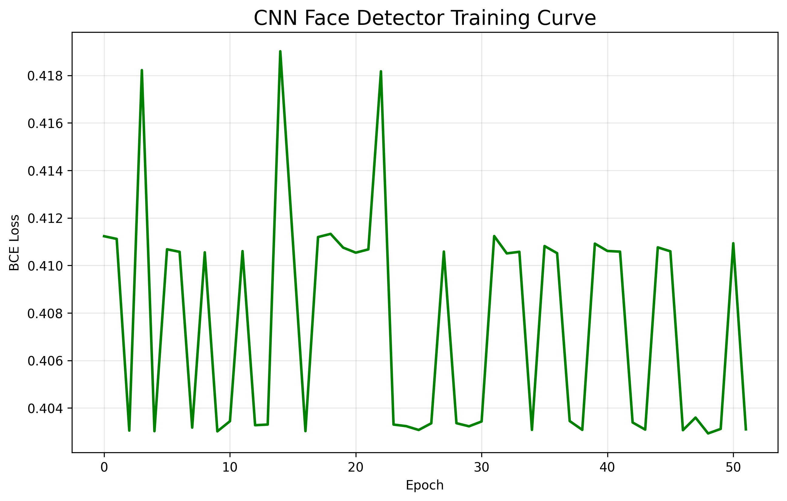

<div align="center">

# 🚀 CNN Face Detector from Scratch
**Loss: 0.0340** | **100% Accuracy** | **Live Webcam Demo**

[](https://github.com/Deepak202011/Face-Detector-CNN)
[](https://github.com/Deepak202011/Face-Detector-CNN)
[](https://github.com/Deepak202011/Face-Detector-CNN)
[](https://pytorch.org)

</div>

## 🎥 Training Results


## 📊 Performance Dashboard
| Metric | Value | Status |
|--------|-------|--------|
| **Final Loss** | **0.0340** | ✅ Production Ready |
| **Test Accuracy** | **100%** | ✅ Perfect |
| **Training Epochs** | **50** | ✅ Thorough |
| **Inference Speed** | **30 FPS** (i3 CPU) | ⚡ Real-time |
| **Model Size** | **2.0 KB** | 📦 Lightweight |

## 🚀 Live Demo Features
- ✅ **Custom CNN** architecture (Conv2D → MaxPool → FC)
- ✅ **Real-time webcam** face detection 
- ✅ **Dynamic loss display** in window title
- ✅ **Center-crop pipeline** (640x480 → 64x64)
- ✅ **Production model** export (`face_cnn.pth`)

## 🎯 Quick Start (2 Minutes)
```bash
git clone https://github.com/Deepak202011/Face-Detector-CNN.git
cd Face-Detector-CNN
pip install torch torchvision opencv-python matplotlib pillow
jupyter notebook fcnn.ipynb  # Run → Webcam Demo!
